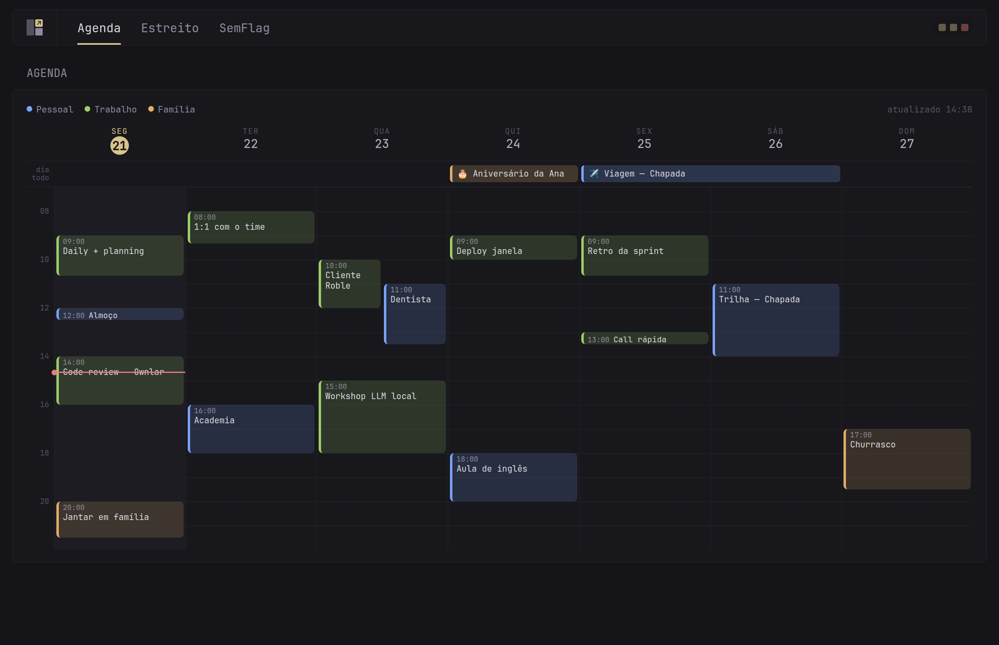
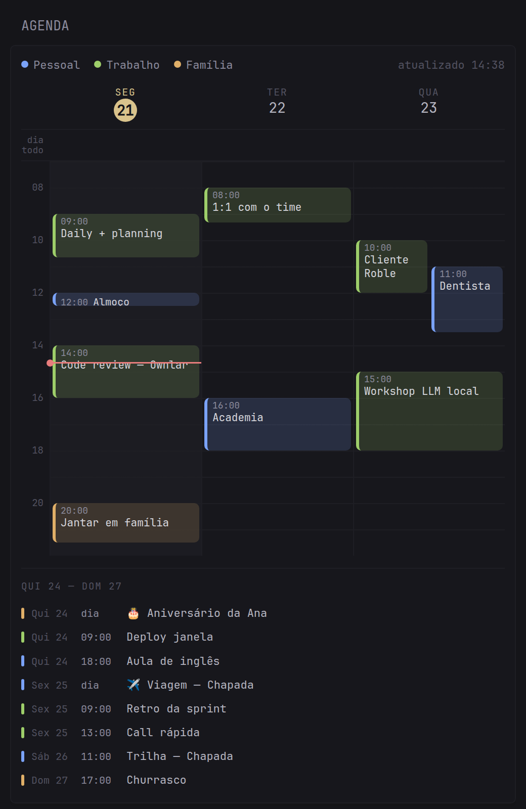
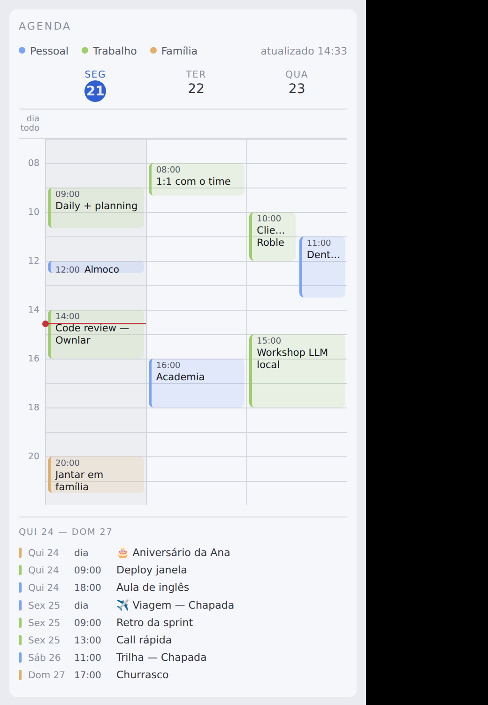

# glance-multi-calendar

Show the events of **several Google accounts** inside your
[Glance](https://github.com/glanceapp/glance) dashboard, as a **7-day grid**
in the style of Google Calendar. One colour per account, every calendar of each
account discovered automatically, recurring events already expanded by the API.



<p align="center">


</p>

Real renders of the demo data inside Glance 0.8.6 (`examples/glance/`) and on
the standalone page in the light theme. In a narrow container the grid keeps
three days and lists the rest below.

> Status: **work in progress**. What works today: the grid widget
> (`/widget/week`, `/`) and `/events.json`, all on demo data. Google OAuth
> and the published image are next.

## Why

Glance's built-in `calendar` widget draws the month but shows no events, the
[calendar-events PR](https://github.com/glanceapp/glance/pull/174) has been
open since 2024 with no ETA, and the existing community bridge accepts a single
ICS URL and renders a list. Nothing handled *multiple accounts* or a *grid*.

## How it works

A small Go service (one static binary, ~7 MB image, amd64 + arm64) that:

1. connects N Google accounts via OAuth, once each;
2. lists every calendar of every account (`calendarList.list`);
3. pulls the events of a rolling window with `singleEvents=true`, so
   recurrence is expanded server-side by Google;
4. merges everything, colours by account, and serves
   - `GET /events.json` for `custom-api` widgets or anything else, and
   - `GET /widget/week`, an HTML fragment for Glance's `extension` widget.

Read-only. It never writes to your calendars.

## Try it in 30 seconds (demo data, no credentials)

```bash
git clone https://github.com/jarndev-ltda/glance-multi-calendar
cd glance-multi-calendar/examples/glance
docker compose up --build        # a throwaway Glance + the widget
# open http://localhost:18081
```

Or just the service: `docker compose up --build` at the repo root, then
`http://localhost:8089/` (standalone page) and `/events.json`.

With no account connected the service serves a fictitious week so you can
evaluate the widget before creating anything in Google Cloud.

## Configuration

`config.yml` (no secrets, see [`config.example.yml`](config.example.yml)):

```yaml
timezone: America/Bahia
refresh: 5m
window: { days: 7, start_hour: 7, end_hour: 22, min_hour: 0, max_hour: 24 }
accounts:
  - { id: personal, name: Personal, color: "#7aa2f7" }
  - { id: work,     name: Work,     color: "#9ece6a" }
```

`.env` (never committed): `GOOGLE_CLIENT_ID`, `GOOGLE_CLIENT_SECRET`.
Refresh tokens are written by the service to `/data/tokens.json` (mode 0600)
inside the volume.

### Google Cloud setup (once, serves all accounts)

1. [console.cloud.google.com](https://console.cloud.google.com) → new project.
2. **APIs & Services → Library** → enable **Google Calendar API**.
3. **OAuth consent screen** → External → app name, support e-mail, scope
   `https://www.googleapis.com/auth/calendar.readonly`.
4. **Publish the app** (status *In production*). While it stays in *Testing*,
   Google expires refresh tokens after 7 days and the widget breaks weekly.
   Unverified apps just show a "Google hasn't verified this app" screen;
   click *Advanced → continue*.
5. **Credentials → Create → OAuth client ID → Web application**, redirect URI
   `http://localhost:8089/oauth/callback`. Google only allows plain HTTP on
   `localhost`, never on a LAN IP, hence the SSH tunnel below.
6. Copy client ID and secret into `.env`.

### Connecting accounts

```bash
ssh -L 8089:localhost:8089 your-server   # only while connecting
# then open http://localhost:8089/connect and log in with each Google account
```

## HTTP API

| Route | Returns |
|---|---|
| `GET /healthz` | `200 ok` |
| `GET /events.json?days=7&from=YYYY-MM-DD` | merged events, sorted by start, times in the configured zone |
| `GET /widget/week` | HTML fragment with `Widget-Title` / `Widget-Content-Type: html` headers, for the `extension` widget |
| `GET /?theme=dark\|light` | the same grid as a standalone page, for debugging in both Glance themes |
| `GET /connect` | *(soon)* connected accounts + "connect another account" |

The grid routes also accept `start_hour`, `end_hour` (override the floor,
still clamped by `min_hour`/`max_hour`) and `accounts=a,b` (filter).

`/events.json` shape:

```json
{
  "generated_at": "2026-09-21T10:38:00-03:00",
  "timezone": "America/Bahia",
  "from": "2026-09-21T00:00:00-03:00",
  "to": "2026-09-28T00:00:00-03:00",
  "accounts": [{ "id": "work", "name": "Work", "color": "#9ece6a", "calendars": [ … ] }],
  "events": [{
    "id": "…", "account": "work", "calendar": "…", "title": "Daily + planning",
    "start": "2026-09-21T09:00:00-03:00", "end": "2026-09-21T10:40:00-03:00",
    "all_day": false, "location": "…", "url": "…", "description": "…"
  }],
  "errors": ["only present when a source failed; the others still render"]
}
```

All-day events carry midnight `start`/`end` with an **exclusive** end, as in
the Google API and RFC 5545.

## Glance widget

```yaml
- type: extension
  url: http://glance-multi-calendar:8080/widget/week   # service name on the compose network
  allow-potentially-dangerous-html: true               # required: without it Glance shows the HTML as text
  cache: 5m
```

Put it in a `full` column: seven day columns need the width. All colours come
from Glance's theme variables (`--color-primary`, `--color-text-*`,
`--color-separator`...), so the widget follows whatever theme is active; the
account colour is the only literal one.

## Development

```bash
go test ./...                                   # includes a golden-file test of the rendered week
go test ./internal/render -update               # refresh the golden after an intended change
go run ./cmd/glance-multi-calendar -config config.example.yml
./scripts/screenshots.sh docs/screenshots       # PNGs of the running service, both themes
docker build --platform linux/arm64 .           # cross-compiles, no qemu needed
```

`mockup/agenda.html` is the original visual specification the template was
ported from.

## License

[MIT](LICENSE)
